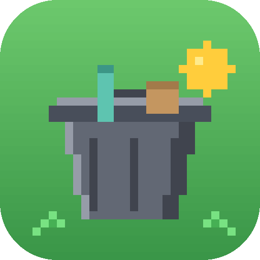

<div align="center">



# Trash Collector Game - Website

**Official Website for Trash Collector Game, a 2D Pixel Platformer Built with Java**

[]()
[]()
[]()
[]()
[]()

[Visit Website](#) • [About](#about) • [Getting Started](#getting-started) • [Disclaimer](#disclaimer)

---

## About

Trash Collector Game - Website is the official marketing and information site for **Trash Collector Game** (v2.3.0), a 2D pixel platformer built purely with Java. The site presents the game's identity through a consistent pixel-art visual language across every page, from typography and buttons to interactive scenes and page transitions, while remaining clean, responsive, and easy to navigate on both desktop and mobile.

The project brings together an interactive hero section, a full character roster, biome previews, gameplay mechanics, controller and keyboard setup, and download information into a single cohesive experience. Every figure and feature shown on the site is sourced directly from the game itself, so the website always stays aligned with what actually exists in-game.

---

## Getting Started

No installation is required to view the live site - simply open the deployed URL in a browser. To run the project locally for development, see [Local Development](#local-development) below.

---

## Site Sections

Trash Collector Game - Website is organized into the following pages, each accessible from the main navigation:

| Page | Route | Description |
|---|---|---|
| Home | `/` | Interactive hero section with a day-night cycle and an overview of all features |
| Characters | `/characters` | The full roster of 16 characters, with a built-in filter for unlocked and locked entries |
| Maps | `/maps` | 5 biomes, each with an interactive, layered parallax preview |
| Trash | `/trash` | Overview of collectible trash items and their in-game value |
| Gameplay | `/gameplay` | World creation options, the seed system, the economy formula, the combo system, and available upgrades |
| Controls | `/controls` | Keyboard controls, Xbox/PlayStation controller mapping, and display settings |
| Download | `/download` | Game downloads, setup instructions, and frequently asked questions |

---

## Core Features

| Feature | Description |
|---|---|
| Pixel-Art Design System | Consistent pixelated visuals across typography, buttons, panels, and page transitions |
| Interactive Hero | Live day-night cycle animation on the landing page |
| Live Biome Previews | Layered parallax scenes rendered per biome instead of static screenshots |
| Controller Showcase | Visual mapping of Xbox/PlayStation controller buttons and keyboard keys |
| Combo & Economy Display | In-game combo meter and economy formula presented interactively |
| Responsive Layout | Optimized pixel-art experience across desktop, tablet, and mobile screen sizes |
| Client-Side Routing | Single-page application routing with scroll-position reset on navigation |

---

## Data Sources

All game data displayed on the site - characters, biomes, trash items, economy values, and controls - is centralized in a single source file (`src/lib/game-data.ts`) and pulled directly from the actual Trash Collector Game (its README, source comments, and in-game constants), ensuring the website never drifts from what the game really contains.

---

## Technology

| Layer | Technology |
|---|---|
| Frontend Framework | React 19 with TypeScript |
| Routing | React Router (client-side SPA routing) |
| Styling | Tailwind CSS 4 |
| Build Tool | Vite |
| Package Manager | npm |
| Hosting & Deployment | Vercel |

---

## Local Development

### Prerequisites

- Node.js (version 18 or later is recommended)
- npm

### Installation

```sh
git clone <this-repository-url>
cd trash-collector-website
npm install
```

### Available Scripts

| Command | Description |
|---|---|
| `npm run dev` | Starts the local development server |
| `npm run build` | Builds the app for production |
| `npm run preview` | Serves the production build locally |

### Running the Project

```sh
npm run dev
```

The site will be available locally once the development server starts, with the terminal output showing the exact local URL.

</div>

---

## Project Structure

```
trash-collector-website/
├── public/                # Static assets (favicon, etc.)
├── src/
│   ├── assets/game/       # Original assets from Trash Collector Game (characters, tiles, controller, biomes)
│   ├── components/        # SiteHeader, SiteFooter, Hero, Reveal, ComboMeter, and other UI components
│   ├── lib/
│   │   ├── game-data.ts       # Central source of all game data (characters, biomes, economy, controls, etc.)
│   │   ├── usePageMeta.ts     # Hook for managing per-page document metadata
│   │   └── useSpotlight.ts    # Hook for interactive spotlight/hover effects
│   ├── pages/              # Home, Characters, Maps, Trash, Gameplay, Controls, Download, NotFound
│   ├── styles.css            # Design system (Tailwind v4 + pixel-art theme)
│   ├── main.tsx                # React application bootstrap
│   └── App.tsx                  # Route definitions
├── index.html                     # Vite HTML entry point
├── vite.config.ts                  # Vite build configuration
└── vercel.json                      # Vercel deployment configuration
```

---

<div align="center">

## Disclaimer

Trash Collector Game - Website is an independent project built to showcase Trash Collector Game and its features. All game assets, names, and content referenced or displayed on the site belong to the Trash Collector Game project. This site is built solely for the purpose of presenting and promoting the game.

---

*Built for Trash Collector Game.*

[Back to Top](#trash-collector-game--website)

</div>